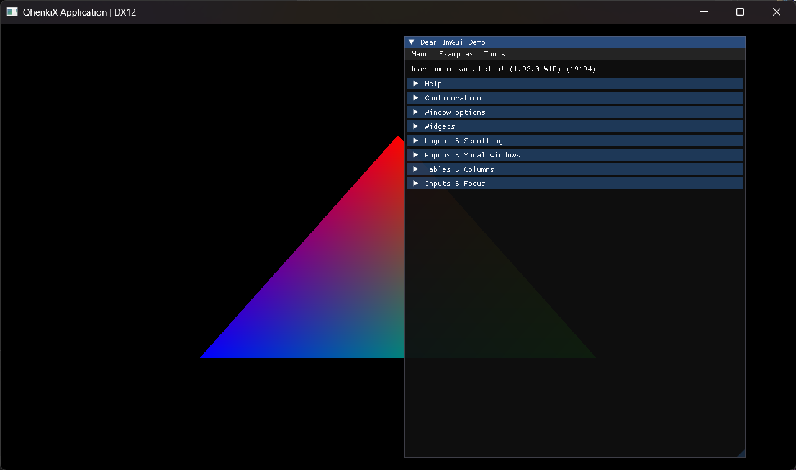

# ImGuiExample

"HelloTriangle" application (SimpleExample without textures or animation) with ImGui integration. This example demonstrates basic ImGui integration with QhenkiX.

## Features

- Basic triangle rendering
- ImGui user interface integration

See ImGui functions in [context.h](https://github.com/AaronTian-stack/QhenkiX/blob/main/QhenkiX/qhenkiX/graphics/qhenki/context.h)

## Command Line Arguments

- `-api <value>` - Select graphics API:
  - `0` - DirectX 12 (Default)
  - `1` - DirectX 11
