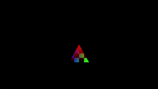

# QhenkiX Examples

This folder contains a collection of example projects demonstrating the usage of the QhenkiX library. Each example is organized as a separate Visual Studio project which has QhenkiX as a local reference.  

## SimpleExample

Demonstrates basic usage of the QhenkiX library. Extends the `Application` class and implements a rendering loop of a textured and animated triangle with vertex colors. [DirectXMath](https://github.com/microsoft/DirectXMath) is used as the linear algebra library.

Operations demonstrated:

- Window and context creation
- Queue and descriptor heap creation
- Swapchain resizing
- Command list recording
- Resource creation (vertex/index/constant buffers, texture uploads)
- Resource binding
- Descriptor management (creation, copying)
- Dynamic shader compilation
- Shader compile macros to support multiple backends
- Rendering pipeline setup
- Fine grained barrier synchronization (uses enhanced barriers in D3D12 backend)
- Double frame buffering with fences

## ImGuiExample

"HelloTriangle" application (SimpleExample without textures or animation) with ImGui integration. See ImGui functions in [context.h](https://github.com/AaronTian-stack/QhenkiX/blob/main/QhenkiX/qhenkiX/graphics/qhenki/context.h)