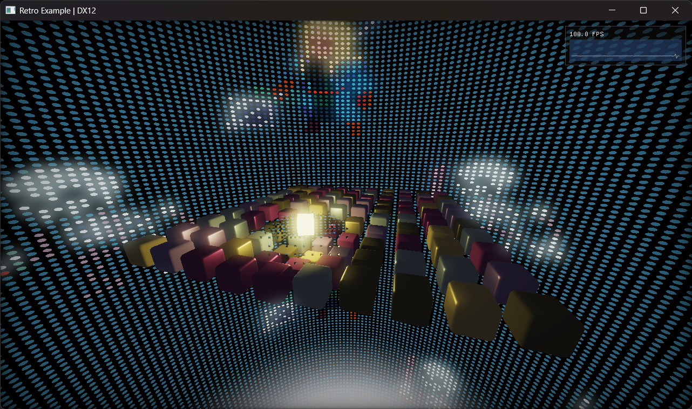

# Retro Example

Rendering example demonstrating graphics techniques such as stencil operations, multiple render passes and render targets, and more advanced shaders.

Inspired by [this demo](https://www.youtube.com/watch?v=XP8g2ngHftY&t=370s).

Art in skybox is from [32rogues asset pack](https://sethbb.itch.io/32rogues).

## Features

- PBR lighting pipeline (Frostbite model)
- Skybox rendering
- Stencil buffer effect
- Bloom post-processing with multi-pass Gaussian blur
- Multiple shader permutation loading
  - See [shader_blob.h](../../QhenkiX/include/qhenki/utility/shader_blob.h)
- Multiple camera views with smooth transitions
  - Press R to switch cameras

## Dependencies

- [tinygltf](https://github.com/syoyo/tinygltf) (MIT License)
- [argparse](https://github.com/p-ranav/argparse) (MIT License)
- [DirectXTex](https://github.com/Microsoft/DirectXTex) (MIT License)

## Command Line Arguments

- `-api <value>` - Select graphics API:
  - `0` - DirectX 12 (Default)
  - `1` - DirectX 11
- `-d` `--debug` - flag to enable graphics API debug layer
- `-t` `--tearing` - flag to enable tearing
- `-f` `--fullscreen` - flag to enable fullscreen
