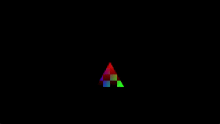

# SimpleExample

Demonstrates basic usage of the QhenkiX library. Extends the `Application` class and implements a rendering loop of a textured and animated triangle with vertex colors.

## Command Line Arguments

- `-dx12` - Use DirectX 12 (default)
- `-dx11` - Use DirectX 11
- `-vk`, `--vulkan` - Use Vulkan
- `-d`, `--debug` - Enable graphics API debug layer
- `-t`, `--tearing` - Enable tearing (vsync off)
- `-f`, `--fullscreen` - Start in fullscreen mode
