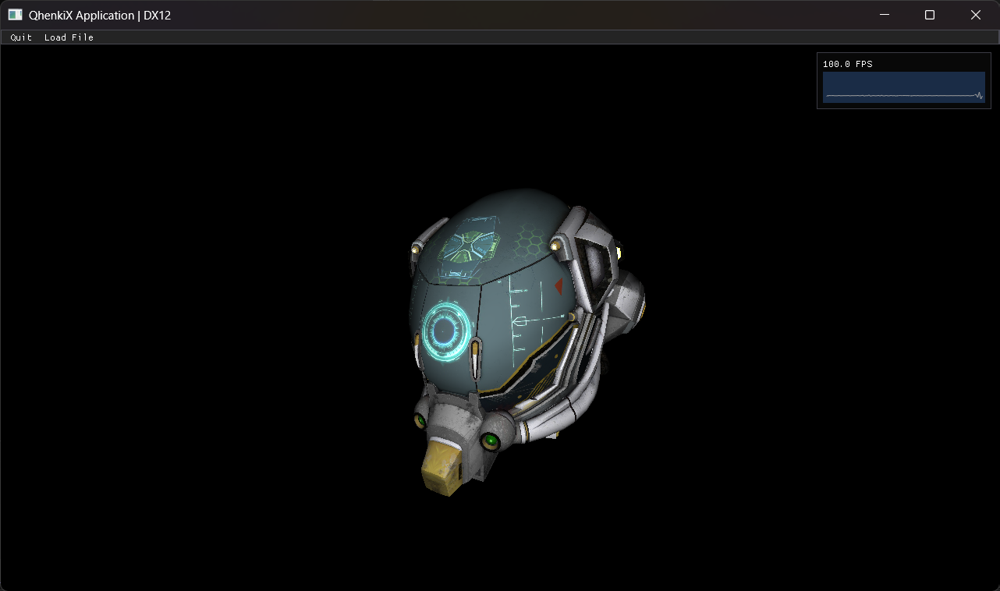

# gltfViewer

A more advanced example demonstrating loading and rendering of glTF 3D models.

## Features

- glTF model loading and parsing
- Scene management
- Material and texture handling

## Dependencies

- [tinygltf](https://github.com/syoyo/tinygltf) (MIT License)
- [argparse](https://github.com/p-ranav/argparse) (MIT License)

## Command Line Arguments

- `-dx12` - Use DirectX 12 (Default)
- `-dx11` - Use DirectX 11
- `-t` `--tearing` - flag to enable tearing
- `-f` `--fullscreen` - flag to enable fullscreen
