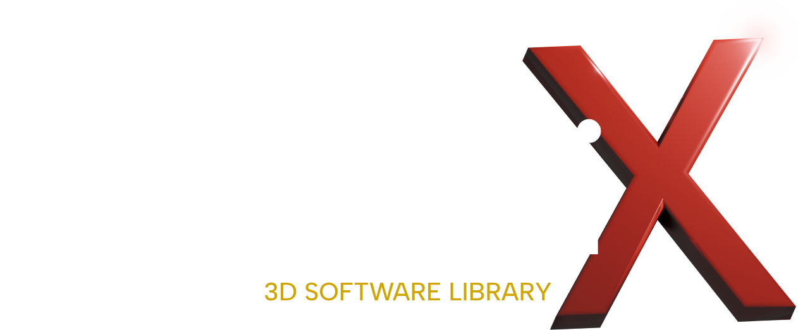

<div align="center">
    
</div>

---

QhenkiX is my personal library designed to abstract graphics operations across multiple graphics APIs, currently supporting Direct3D 12 and Direct3D 11, with future plans to support [Vulkan](https://github.com/AaronTian-stack/qhenki-renderer). Written in C++20, it aims to serve as a graphics layer for a planned game project while providing a way to experiment with graphics techniques and different graphics APIs.

## Features

You can find the most recent interface in [context.h](https://github.com/AaronTian-stack/QhenkiX/blob/main/QhenkiX/qhenkiX/graphics/qhenki/context.h) and the related structures in the folder [qhenki](https://github.com/AaronTian-stack/QhenkiX/tree/main/QhenkiX/qhenkiX/graphics/qhenki). API specific implementations are in their respective folders.

As a very brief summary, here are some notable current features and design choices:

- D3D12 and D3D11 graphics backend
    - Interface designed to target/resemble D3D12
    - Finer grained synchronization based off D3D12 enhanced barriers
- Support for runtime shader compliation
    - Automatic selection between FXC and DXC depending on desired Shader Model
    - Reflection for automatic input assembly parameters
- Separate resource binding models for "modern" and "compatibility" graphics backends
    - Modern interface resembles D3D12 binding model which allows for flexible and performant binding patterns such as bindless descriptors
    - Compatibility interface allows for simple binding of resources to slots with minimal additional code

See the [examples](Examples/README.md) for use cases of the library.

## Installation / Build

### Windows 10+

1. Clone the repository. 
    ```bash
    git clone https://github.com/AaronTian-stack/QhenkiX.git
    ```
2. Open `QhenkiX.vcxproj` or add the project to your already existing desired Visual Studio solution.
3. Build QhenkiX in the desired mode (Debug/Release) to produce a static library (`.lib`). Link this to your project.
4. Add `QhenkiX/include` as an include path. 
5. Follow the steps in the [Linking Section](#linking).
6. Extend the [Application](https://github.com/AaronTian-stack/QhenkiX/blob/main/QhenkiX/qhenkiX/application.h) class and start writing your graphics code. See the [examples](Examples/README.md).

## Linking

QhenkiX is built as a static library (`.lib`). If you are creating a project using QhenkiX in Visual Studio, you can simply add QhenkiX as a reference (right click Project -> Add -> Reference) if they are in the same solution. 

QhenkiX requires the below `.dll`s to run. They are included with the library and can be added as existing files or copied to your project executable location.

 **Required DLLs**:
- [`dxcompiler.dll`](https://github.com/AaronTian-stack/QhenkiX/blob/main/QhenkiX/dxc_2024_07_31/bin/x64/dxcompiler.dll) - compile SM 5.1+ shaders programmatically
- [`dxil.dll`](https://github.com/AaronTian-stack/QhenkiX/blob/main/QhenkiX/dxc_2024_07_31/bin/x64/dxil.dll) - validate/sign shaders generated with DXC
- [`SDL3.dll`](https://github.com/AaronTian-stack/QhenkiX/blob/main/QhenkiX/SDL3-3.2.4/lib/x64/SDL3.dll) - windowing and input

## Dependencies

This project relies on the following dependencies:

- [Boost](https://github.com/boostorg/boost) - (Boost Software License 1.0)
- [D3D12MemAllocator](https://github.com/GPUOpen-LibrariesAndSDKs/D3D12MemoryAllocator) - (MIT License)
- [robin-map](https://github.com/Tessil/robin-map) - (MIT License)
- [DXC (DirectX Shader Compiler)](https://github.com/microsoft/DirectXShaderCompiler) - (MIT License)
- [SDL3](https://github.com/libsdl-org/SDL) - (zlib License)
- [DirectXTex](https://github.com/microsoft/DirectXTex) - (MIT License)

## Documentation

This project is mostly made for my own use and will be frequently subject to large breaking changes, so there is not any documentation currently besides certain select functions. However I will eventually create a wiki of some sort and also explain my design choices in detail...

## Notes

- The DirectX debug layer is only enabled when the project is built in Debug mode.
- FXC depends on `d3dcompiler_47.dll` which is not included with this library. This is included with the Windows SDK and that specific version is used by `D3DCompileFromFile`. I will eventually bundle a specific version of the DLL with the library.
- It should be possible to run the D3D11 backend on Windows 7 or 8, I just need to refactor (bundling D3D12 headers with the library directly) and maybe add a special compile macro.

## References

[A list of useful references I found during the creation of this project.](Media/references.md)

## License

This project is licensed under the [MPL 2.0](./LICENSE) license.
