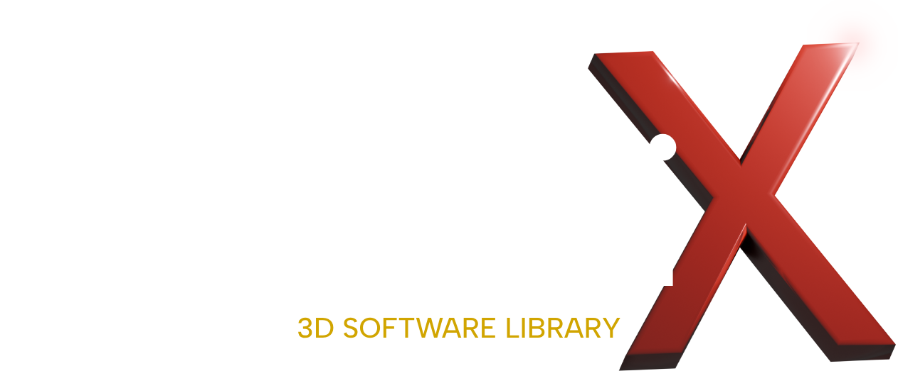

<div align="center">
    
</div>

---

QhenkiX is a personal C++20 library for 3D software creation. It is centered around a render hardware interface (RHI) that abstracts graphics operations across multiple APIs. The project currently includes D3D12, D3D11, and Vulkan backend code paths, plus an examples workspace and a standalone shader compiler frontend ([SXC](SXC/README.md)). It aims to serve as a base for a game project while providing a way for me to experiment with graphics techniques and different graphics APIs.

## Features

You can find the core RHI interfaces in the [RHI folder](QhenkiX/include/qhenki/RHI). Backend implementations live in [QhenkiX/qhenki/graphics](QhenkiX/qhenki/graphics).

Current highlights:

- Multi-backend rendering architecture:
    - D3D12 backend
    - D3D11 backend
    - Experimental Vulkan 1.4 backend
        - Uses the cutting edge [VK_EXT_descriptor_heap](https://docs.vulkan.org/features/latest/features/proposals/VK_EXT_descriptor_heap.html) extension
        - Uses all the modern Vulkan features, such as timeline semaphores, dynamic rendering, sync2, etc.
    - Shaders can be shared across backends
- RHI design modeled to resemble D3D12
- Separate binding model support for modern and "compatibility" backends
    - Allows for flexible and performant binding patterns such as bindless descriptors
- Fine-grained synchronization model with enhanced barrier-style concepts
- Standalone shader batch compiler tool: [SXC](SXC/README.md)
    - Command line tool for parallel incremental compilation of shaders
- ImGui integration
- Utility modules for math, transforms, file IO, and memory

See [Examples](Examples) for use cases of the library.

## System Requirements

- D3D12/D3D11 backend: Windows 10/11.
- Vulkan backend:
    - Vulkan 1.4 core
    - VK_EXT_DESCRIPTOR_HEAP_EXTENSION
        - **This requires installing the latest beta graphics drivers from [NVIDIA](https://developer.nvidia.com/vulkan-driver) or [AMD Adrenalin Edition for Expanded Vulkan Extension](https://www.amd.com/en/resources/support-articles/release-notes/RN-RAD-WIN-VULKAN.html).**
    - VK_EXT_MEMORY_BUDGET_EXTENSION
    - VK_EXT_MEMORY_PRIORITY_EXTENSION
    - VK_KHR_MAINTENANCE_9_EXTENSION
    - VK_KHR_ROBUSTNESS_2_EXTENSION
    - VK_GOOGLE_HLSL_FUNCTIONALITY_1_EXTENSION
    - VK_GOOGLE_USER_TYPE_EXTENSION
    
## Installation / Build

1. Clone the repository with submodules.
    ```bash
    git clone --recurse-submodules https://github.com/AaronTian-stack/QhenkiX.git
    ```
2. Generate build files using CMake.
    ```bash
    cd QhenkiX
    mkdir build
    cd build
    cmake ..
    ```
3. Build the workspace.
    ```bash
    cmake --build . --config Release
    ```
    Or open the generated Visual Studio solution (`QhenkiX-Workspace.slnx`) and build from there.

4. [Link the library to your app](#linking).

5. Extend the [Application](QhenkiX/include/qhenki/application.h) class and start building your app. See [Examples/README.md](Examples/README.md).

## Linking

QhenkiX is built as a static library (`.lib`).

### Using CMake

When using CMake, simply link against the QhenkiX target:

```cmake
target_link_libraries(your_target PRIVATE QhenkiX)
```

### Using Visual Studio

If you are creating a project using QhenkiX in Visual Studio, you can add QhenkiX as a reference (right click Project -> Add -> Reference) if they are in the same solution.

### Required Runtime Shared Libraries

QhenkiX requires several shared libraries to run. When using CMake, the examples automatically copy the required DLLs to the output directory. If you writing your own project you will need to ensure the following DLLs are available in your executable's directory:

#### Windows

- `dxcompiler.dll` - compile shaders with DXC
- `dxil.dll` - validate/sign shaders generated with DXC
- `SDL3.dll` - SDL3 runtime library

## Dependencies

This project relies on the following dependencies and build tools:

**Build Requirements:**
- CMake 3.21 or higher
- C++20 compiler

**Third-party Libraries:**
- [Boost](https://github.com/boostorg/boost) - (Boost Software License 1.0)
- [D3D12MemAllocator](https://github.com/GPUOpen-LibrariesAndSDKs/D3D12MemoryAllocator) - (MIT License)
- [D3D12DescriptorHelpers](https://github.com/sawickiap/D3D12DescriptorHelpers) - (Public Domain)
- [robin-map / tsl](https://github.com/Tessil/robin-map) - (MIT License)
- [DXC (DirectX Shader Compiler)](https://github.com/microsoft/DirectXShaderCompiler) - (LLVM/NCSA + MIT)
- [DirectX Headers](https://github.com/microsoft/DirectX-Headers) - (MIT License)
- [DirectXMath](https://github.com/microsoft/DirectXMath) - (MIT License)
- [DirectXTex](https://github.com/microsoft/DirectXTex) - (MIT License)
- [SDL3](https://github.com/libsdl-org/SDL) - (zlib License)
- [Dear ImGui](https://github.com/ocornut/imgui) - (MIT License)
- [Vulkan-Headers](https://github.com/KhronosGroup/Vulkan-Headers) - (Apache 2.0)
- [volk](https://github.com/zeux/volk) - (MIT License)
- [vk-bootstrap](https://github.com/charles-lunarg/vk-bootstrap) - (MIT License)
- [SPIRV-Cross](https://github.com/KhronosGroup/SPIRV-Cross) - (Apache 2.0)
- [Vulkan Memory Allocator](https://github.com/GPUOpen-LibrariesAndSDKs/VulkanMemoryAllocator) - (MIT License)
- [magic_enum](https://github.com/Neargye/magic_enum) - (MIT License)
- [utf8cpp](https://github.com/nemtrif/utfcpp) - (Boost Software License 1.0)

## Documentation

This project is primarily for personal use and and will be frequently subject to large breaking changes, so there is not any documentation currently besides certain select functions. However I will eventually create a wiki of some sort and also explain my design choices in detail...

## Notes

- FXC depends on `d3dcompiler_47.dll` which is not included with this library. It is included with the Windows SDK. I will eventually bundle a specific version of the DLL with the library.

## License

This project is licensed under the [MIT](./LICENSE) license.
